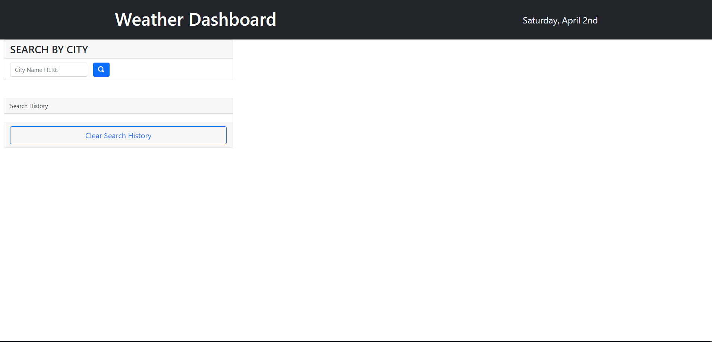

# Weather-Dashboard

I was tasked with make a weather dashboard for travle planning.

Main Features:

    For convinience, current date is displayed on the header at all times, while the time will only show when a search is performed;
    By entering a City name in the search field, the app will render current weather information(note: UV Index data is provided only for 12:00 p.m.) and next 5 days high temperatures and humidity;
    The search history is saved and can be used to access those cities weather information by clicking on the buttons;
    For accessibility, the App will render apropriate icons of the weather(ex: cloudy, clear, t-storm, etc);

Links:

    Live page:  https://pisanoz.github.io/Weather-Dashboard/
    GitHub: https://github.com/Pisanoz/Weather-Dashboard

